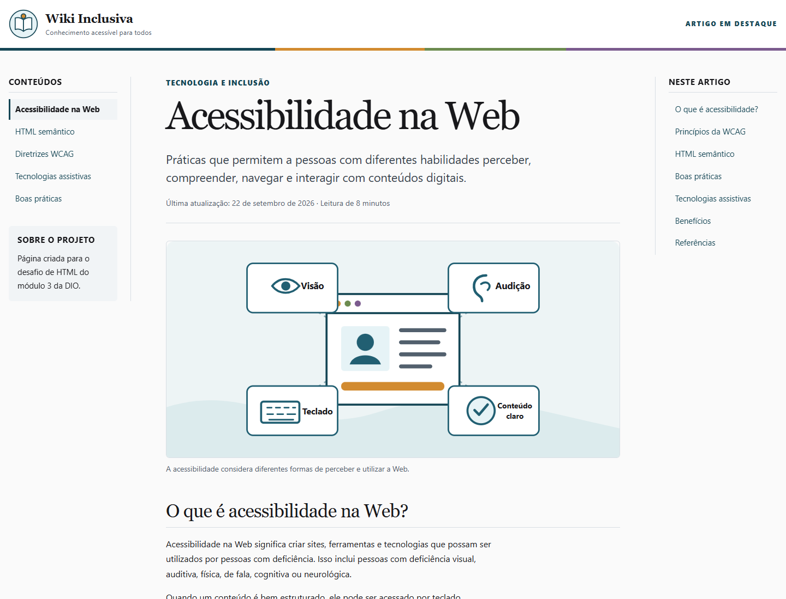
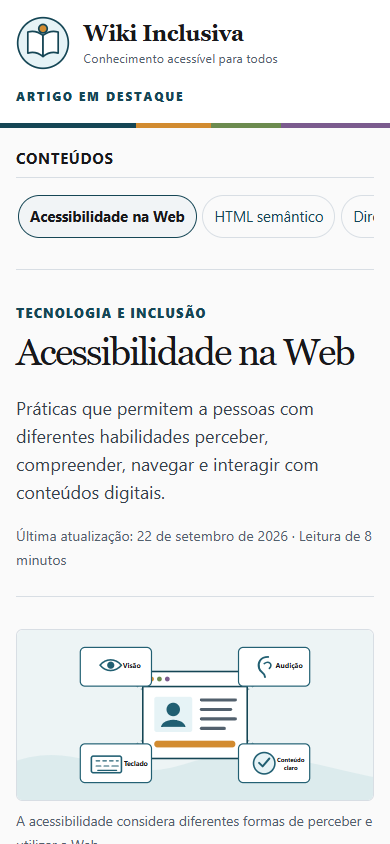

# Wiki Inclusiva — Acessibilidade na Web

Uma página enciclopédica inspirada na Wikipédia, desenvolvida para praticar **estrutura HTML, semântica e acessibilidade** no desafio do módulo 3 da [Formação HTML Web Developer da DIO](https://github.com/digitalinnovationone/trilha-html-modulo-3).

## Prévia do projeto

<p align="center">
  
</p>

<p align="center">
  
</p>

## Sobre

O projeto apresenta um artigo completo sobre **Acessibilidade na Web**. O conteúdo explica os princípios da WCAG, a importância do HTML semântico, o papel das tecnologias assistivas e boas práticas para criar experiências digitais inclusivas.

O visual mantém a organização familiar de uma enciclopédia, com menu lateral, artigo central e sumário de seções, mas adota uma interface mais leve, responsiva e fácil de navegar.

## Recursos de acessibilidade

- Link para pular diretamente ao conteúdo principal.
- Estrutura com `header`, `nav`, `main`, `article`, `section`, `aside` e `footer`.
- Hierarquia lógica de títulos, com apenas um `h1`.
- Navegação completa por teclado e foco visível.
- Imagens com texto alternativo ou indicação decorativa adequada.
- Tabela com `caption`, cabeçalhos e escopos definidos.
- Abreviações explicadas com a tag `abbr`.
- Contraste legível e suporte ao modo de alto contraste.
- Respeito à preferência por redução de movimentos.
- Layout responsivo para computadores, tablets e celulares.

## Tecnologias utilizadas

- HTML5
- CSS3
- SVG
- Semântica Web
- Boas práticas da WCAG

## Estrutura de arquivos

```text
wiki-inclusiva/
├── assets/
│   ├── css/
│   │   └── style.css
│   └── images/
│       ├── acessibilidade-web.svg
│       └── logo-wiki-inclusiva.svg
├── screenshots/
│   ├── desktop-preview.png
│   ├── desktop.png
│   ├── mobile-preview.png
│   └── mobile.png
├── index.html
└── README.md
```

## Como visualizar

1. Baixe ou clone este repositório.
2. Abra o arquivo `index.html` em qualquer navegador moderno.

Não é necessário instalar dependências nem executar servidor.

## Referências de conteúdo

- [W3C WAI — Introdução à acessibilidade na Web](https://www.w3.org/WAI/fundamentals/accessibility-intro/)
- [W3C WAI — Visão geral da WCAG 2](https://www.w3.org/WAI/standards-guidelines/wcag/)
- [W3C WAI — WCAG 2 em resumo](https://www.w3.org/WAI/standards-guidelines/wcag/glance/)
- [MDN Web Docs — Semântica](https://developer.mozilla.org/pt-BR/docs/Glossary/Semantics)

## Autor

Desenvolvido por **Samuel Monsalves Moreira** como parte dos estudos de HTML na DIO.

---

> Acessibilidade é essencial para alguns e útil para todos.

